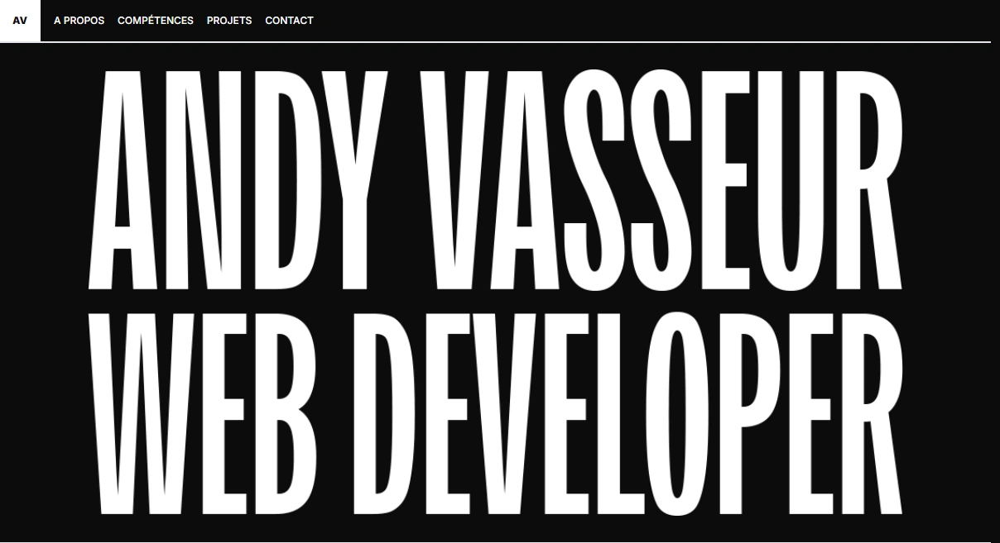

# Andy Vasseur's Portfolio

Welcome to my personal portfolio. This project showcases my work as a developer and is built using modern web technologies including ViteJS, TypeScript, and TailwindCSS. Not the final version yet, but I'm still working on it !

<div align="center">
  
</div>

## Table of Contents

- [Introduction](#introduction)
- [Features](#features)
- [Installation](#installation)
- [Technologies](#technologies)
- [License](#license)

## Introduction

This portfolio is a reflection of my skills and projects as a web developer. It is designed to provide a seamless experience while being fast and responsive. You can explore the live version here: [andy-vasseur.vercel.app](https://andy-vasseur.vercel.app/).

## Features

- **Modern UI/UX:** Built with TailwindCSS for fast and responsive design.
- **Optimized Performance:** Using ViteJS for quick build times and fast refresh.
- **TypeScript Integration:** Ensuring strong typing and clean code.

## Installation

To run this project locally, follow the steps below:

1. Clone the repository:
   ```bash
   git clone https://github.com/Andy-Vasseur/portfolio_2025.git
   ```
2. Navigate to the project folder:
   ```bash
   cd portfolio_2025
   ```
3. Install dependencies:
   ```bash
   yarn or yarn install
   ```
4. Run the development server:
   ```bash
   yarn dev
   ```

## Technologies

- ReactJS
- Typescript
- TailwindCSS
- Formspree
- ViteJS

## Usage

After installing and running the project, open [http://localhost:5173](http://localhost:5173) in your browser to view the portfolio.

To build the project for production, run:

```bash
yarn build
```

## License

MIT License

Copyright (c) 2024 Andy Vasseur

Permission is hereby granted, free of charge, to any person obtaining a copy
of this software and associated documentation files (the "Software"), to deal
in the Software without restriction, including without limitation the rights
to use, copy, modify, merge, publish, distribute, sublicense, and/or sell
copies of the Software, and to permit persons to whom the Software is
furnished to do so, subject to the following conditions:

The above copyright notice and this permission notice shall be included in all
copies or substantial portions of the Software.

THE SOFTWARE IS PROVIDED "AS IS", WITHOUT WARRANTY OF ANY KIND, EXPRESS OR
IMPLIED, INCLUDING BUT NOT LIMITED TO THE WARRANTIES OF MERCHANTABILITY,
FITNESS FOR A PARTICULAR PURPOSE AND NONINFRINGEMENT. IN NO EVENT SHALL THE
AUTHORS OR COPYRIGHT HOLDERS BE LIABLE FOR ANY CLAIM, DAMAGES OR OTHER
LIABILITY, WHETHER IN AN ACTION OF CONTRACT, TORT OR OTHERWISE, ARISING FROM,
OUT OF OR IN CONNECTION WITH THE SOFTWARE OR THE USE OR OTHER DEALINGS IN THE
SOFTWARE.
